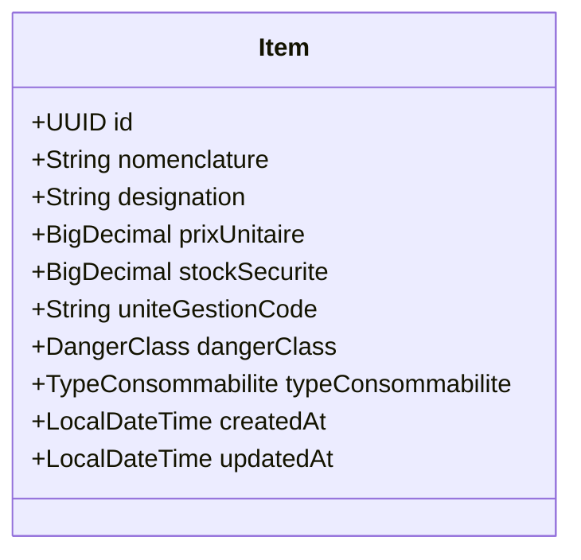

# Plan d'Implémentation — Compaction de la table des articles & Recherche par nomenclature (12 caractères)

Ce plan d'implémentation décrit la refonte technique visant à remplacer la nomenclature éclatée en 5 colonnes (`classeCode`, `sousClasseCode`, `categorieCode`, `serieCode`, `itemCode`) par une colonne unique indexée `nomenclature` de 12 caractères. Il détaille également la création d'une interface de recherche intelligente par nomenclature dans le catalogue.

---

## 🎯 Objectifs

1. **Compaction des Articles** : 
   * Supprimer la dispersion de la nomenclature sur 5 colonnes.
   * Créer une colonne unique `nomenclature` de 12 caractères (`VARCHAR(12)`) dans la table `items` avec contrainte d'unicité et indexation pour accélérer les performances de recherche.
   * Mettre à jour la logique JPA, le chargeur de données (`DataSeeder`), le service d'intégration ETL (`PlanArmementMigrationService`), ainsi que les DTOs correspondants.
2. **Recherche par Nomenclature (12 caractères)** :
   * Simplifier le moteur de recherche backend (`ItemSpecification`) pour utiliser la nouvelle colonne directe au lieu de faire des concaténations SQL coûteuses.
   * Ajouter une barre de recherche dédiée dans l'UI du catalogue, dotée d'un masque de saisie ou d'un validateur visuel à 12 caractères avec un délai de frappe (debouncing de 300ms) pour une expérience utilisateur premium.

---

## ⚠️ User Review Required

> [!WARNING]
> **Impact sur la base de données de production & d'intégration :**
> Le passage d'une nomenclature éclatée à une nomenclature compactée nécessite une migration de données. Si des données réelles sont présentes en base sans passer par le `DataSeeder`, les colonnes existantes devront être fusionnées via un script SQL ou via Hibernate `ddl-auto: update` combiné avec une migration de données temporaire.

> [!NOTE]
> **Restauration de la compatibilité ascendante :**
> Le format à 12 caractères respecte scrupuleusement la structure Gamma 2 (2 + 2 + 2 + 2 + 4 caractères). La propriété calculée `getNomenclature()` est remplacée par un attribut direct en base, améliorant les requêtes de tri et d'indexation.

---

## ❓ Open Questions

> [!IMPORTANT]
> 1. **Faut-il conserver temporairement les 5 colonnes éclatées ?**
>    * *Option A (Recommandée) :* Suppression totale des 5 colonnes pour obtenir une base propre et compacte.
>    * *Option B :* Conservation des 5 colonnes en mode déprécié (`@Deprecated`) pour assurer une transition en douceur si d'autres composants non encore inspectés en dépendent.
> 2. **Quel format visuel préférez-vous pour le champ de saisie de la nomenclature ?**
>    * *Option A (Masquée) :* Un champ avec masque PrimeNG (ex: `99-99-99-99-9999`) pour guider l'utilisateur.
>    * *Option B (Texte brut avec validation) :* Un champ texte classique acceptant 12 caractères alphanumériques avec indicateur visuel de validité (vert si 12 caractères, rouge si incomplet).

---

## 🏛️ Modèle de Données Conceptuel (PostgreSQL)



---

## 💻 Proposed Changes

---

### 1. Backend (`gamma3-backend`)

#### [MODIFY] [Item.java](file:///c:/Projets/GAMMA3/gamma3-backend/src/main/java/tn/defense/gamma3/catalogue/domain/Item.java)
* Supprimer les champs `classeCode`, `sousClasseCode`, `categorieCode`, `serieCode`, et `itemCode`.
* Ajouter le champ unique `nomenclature` :
  ```java
  @Column(name = "nomenclature", length = 12, nullable = false, unique = true)
  private String nomenclature;
  ```
* Ajuster le builder et les constructeurs. Conserver une méthode utilitaire ou adapter `getNomenclature()` pour retourner directement ce champ.

#### [MODIFY] [ItemRepository.java](file:///c:/Projets/GAMMA3/gamma3-backend/src/main/java/tn/defense/gamma3/catalogue/repository/ItemRepository.java)
* Remplacer la méthode de recherche legacy :
  - Supprimer `findByClasseCodeAndSousClasseCodeAndCategorieCodeAndSerieCodeAndItemCode(...)`.
  - Ajouter `Optional<Item> findByNomenclature(String nomenclature);`.

#### [MODIFY] [ItemSpecification.java](file:///c:/Projets/GAMMA3/gamma3-backend/src/main/java/tn/defense/gamma3/catalogue/repository/ItemSpecification.java)
* Supprimer les concaténations SQL complexes (`cb.concat`).
* Réécrire `searchByNomenclatureOrDesignation` pour requêter directement le champ `nomenclature` :
  ```java
  Expression<String> nomenclatureExpr = cb.upper(root.get("nomenclature"));
  ```

#### [MODIFY] [ItemController.java](file:///c:/Projets/GAMMA3/gamma3-backend/src/main/java/tn/defense/gamma3/catalogue/api/ItemController.java)
* Mettre à jour le tri par défaut (`sortBy`) pour utiliser `"nomenclature"` au lieu de la chaîne concaténée de 5 colonnes.
* Modifier la construction du `ItemSummaryDto` pour passer directement `item.getNomenclature()` et renvoyer des valeurs vides ou découpées pour les anciens champs DTO afin d'éviter de casser le frontend immédiatement (ou nettoyer le DTO).

#### [MODIFY] [ItemSummaryDto.java](file:///c:/Projets/GAMMA3/gamma3-backend/src/main/java/tn/defense/gamma3/catalogue/api/ItemSummaryDto.java)
* Nettoyer ou adapter le Record pour refléter la nomenclature unique (conserver les anciens champs temporairement à `null` ou les supprimer définitivement si le frontend est adapté en même temps).

#### [MODIFY] [PlanArmementMigrationService.java](file:///c:/Projets/GAMMA3/gamma3-backend/src/main/java/tn/defense/gamma3/migration/PlanArmementMigrationService.java)
* Adapter la récupération de la nomenclature concaténée issue de SQL Server (Gamma2) :
  ```java
  String nomenclature = (classeCode + sousClasseCode + categorieCode + serieCode + itemCode).trim();
  ```
* Utiliser directement `nomenclature` pour interroger le cache des articles `itemCache`.

#### [MODIFY] [DataSeeder.java](file:///c:/Projets/GAMMA3/gamma3-backend/src/main/java/tn/defense/gamma3/config/DataSeeder.java)
* Remplacer les appels aux builders d'articles contenant les 5 sous-champs par le champ unique `nomenclature` (ex: `130514123456`).
* Simplifier la requête SQL de synchronisation avec la table `legacy.item` :
  ```sql
  UPDATE items i 
  SET type_consommabilite = CASE WHEN trim(l.consommabilitecode) = 'C' THEN 'CONSOMMABLE' ELSE 'NON_CONSOMMABLE' END 
  FROM legacy.item l 
  WHERE i.nomenclature = (trim(l.classecode::text) || trim(l.sousclassecode) || trim(l.categoriecode) || trim(l.seriecode) || trim(l.itemcode))
  ```

---

### 2. Frontend (`gamma3-frontend`)

#### [MODIFY] [item.service.ts](file:///c:/Projets/GAMMA3/gamma3-frontend/src/app/features/catalogue/item.service.ts)
* Adapter l'interface `Item` pour supprimer les propriétés éclatées optionnelles et ne conserver que `nomenclature: string`.

#### [MODIFY] [catalogue.component.ts](file:///c:/Projets/GAMMA3/gamma3-frontend/src/app/features/catalogue/catalogue.component.ts)
* Mettre à jour la variable de tri `sortField` par défaut pour utiliser `'nomenclature'`.
* Importer les validateurs ou ajouter une propriété réactive pour suivre la saisie de la nomenclature.

#### [MODIFY] [catalogue.component.html](file:///c:/Projets/GAMMA3/gamma3-frontend/src/app/features/catalogue/catalogue.component.html)
* Remplacer la colonne de recherche multi-colonnes par une colonne unique **Nomenclature** de 12 caractères.
* Ajouter un champ de recherche spécifique "Recherche par Nomenclature" à côté de la recherche par désignation, avec un indicateur esthétique à 12 caractères.
* Utiliser les styles premium existants pour assurer la cohérence visuelle.

---

## 🧪 Plan de Vérification

### Automated Tests
- Lancement de `gradlew test` sur le backend pour s'assurer qu'aucun test d'intégration (comme `ReformeServiceIT.java`) n'est rompu.
- Lancement de `npm test` sur le frontend pour valider le composant du catalogue.

### Manual Verification
1. **Démarrage & Seeding :**
   * Supprimer l'ancienne table `items` ou vider la base de données locale pour forcer la régénération des tables par Hibernate.
   * Démarrer le backend et vérifier que le `DataSeeder` insère correctement les articles avec leur nomenclature compactée à 12 caractères.
2. **Recherche & Filtrage :**
   * Saisir une nomenclature exacte de 12 caractères (ex: `130514123456`) dans la nouvelle barre de recherche.
   * Vérifier que l'article s'affiche instantanément sans erreur de requête SQL.
3. **Tri & Performance :**
   * Cliquer sur l'en-tête de la colonne "Nomenclature" pour vérifier que le tri ascendant/descendant fonctionne de manière stable et performante.
