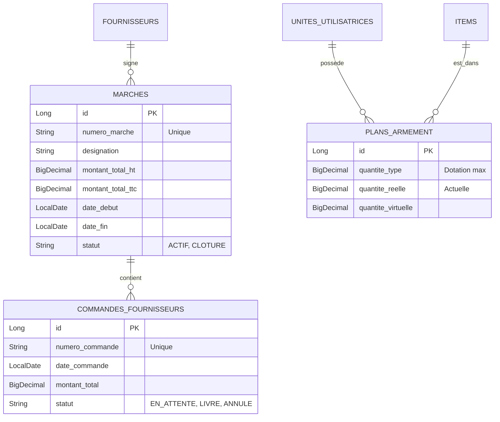

# Plan d'Implémentation — Sprint 10 : Marchés, Commandes Fournisseurs & Plans d'Armement (Dotations)

Ce plan décrit les changements techniques et visuels nécessaires pour concevoir et implémenter le **Sprint 10**. Il introduit la gestion administrative des contrats d'approvisionnement (Marchés), la passation des bons de commande, et concrétise le concept militaire réglementaire de **Plan d'Armement** pour restreindre le catalogue d'articles selon l'unité connectée.

---

## 🎯 Objectifs du Sprint

1. **Gestion des Marchés** :
   * Créer le schéma de base de données pour les **Marchés** (contrats cadres de la DA).
   * Fournir les services et contrôleurs REST pour créer, éditer et lister les marchés.
2. **Commandes Fournisseurs** :
   * Permettre la liaison de bons de commande fournisseurs à un marché spécifique.
   * Afficher de manière dynamique la consommation du budget du marché par rapport aux commandes déjà émises.
3. **Plans d'Armement (Dotations)** :
   * Créer la table d'association `plans_armement` (`unite_id`, `item_id`, `quantite_type`...).
   * **Sécurité & Filtrage** : Modifier l'API de consultation des articles pour que les utilisateurs de rôle `UNIT_USER` (les clients) ne voient **que** les articles inscrits dans le Plan d'Armement de leur propre unité.
   * **UI/UX Premium** : Ajouter des indicateurs visuels de dotation autorisée sur les articles, et déverrouiller l'onglet interactif "Marchés" de la fiche Fournisseur en y injectant les données de la base de données réelle.

---

## 🏛️ Architecture & Modèle de Données (PostgreSQL)

---

## 💻 Modifications Proposées (Par Composant)

### 1. Backend (`gamma3-backend`)

#### [NEW] `tn.defense.gamma3.tiers.domain.Marche.java`
* Entité JPA représentant un marché public ou contrat cadre.
* Relation `@ManyToOne` vers `Fournisseur`.

#### [NEW] `tn.defense.gamma3.tiers.domain.CommandeFournisseur.java`
* Entité JPA représentant un Bon de Commande.
* Relation `@ManyToOne` vers `Marche` (optionnel) et `Fournisseur` (obligatoire).

#### [NEW] `tn.defense.gamma3.tiers.domain.PlanArmement.java`
* Entité d'association unique : `@UniqueConstraint(columnNames = {"unite_id", "item_id"})`.
* Contient la dotation cible (`quantiteType`), la quantité en service réel à bord (`quantiteReelle`), et la quantité virtuelle (`quantiteVirtuelle`).

#### [NEW] Repositories & REST Controllers
* `MarcheRepository.java`, `MarcheController.java` (Endpoints CRUD `/api/marches`).
* `PlanArmementRepository.java`, `PlanArmementController.java` (Endpoints `/api/plans-armement`).

#### [MODIFY] `tn.defense.gamma3.catalogue.controller.ItemController.java`
* Intercepter le contexte d'authentification de l'utilisateur connecté via Spring Security :
  * Si l'utilisateur possède le rôle `ROLE_UNIT_USER` (compte client d'une unité), l'endpoint de recherche `/api/items` applique automatiquement une restriction (Jointure SQL / Clause Where) pour ne retourner que les articles figurant dans son `PlanArmement`.
  * Si le rôle est `ROLE_ADMIN` ou `ROLE_DA_MANAGER`, le catalogue complet est exposé avec la possibilité de voir et de modifier toutes les dotations.

#### [MODIFY] `tn.defense.gamma3.config.DataSeeder.java`
* Générer un jeu de données réaliste :
  * Créer des marchés actifs pour les fournisseurs existants.
  * Associer un plan d'armement par défaut (ex: 5 à 15 articles types avec des dotations de 5, 10 ou 20 unités) pour les unités phares (`DMEN`, `DRC`, `RPS`, `CFISM`) afin de simuler immédiatement et parfaitement les filtres clients.

---

### 2. Frontend (`gamma3-frontend`)

#### [NEW] Services & Types Angular
* `marche.service.ts` : Appels API pour récupérer les contrats et bons de commande.
* `plan-armement.service.ts` : Appels API pour gérer les dotations par unité.

#### [MODIFY] `FournisseurDetailComponent`
* **Déverrouillage de l'onglet "Marchés & Achats (Sprint 10)"** :
  * Supprimer le floutage CSS et l'overlay cadenas "Sprint 10".
  * Charger dynamiquement depuis le backend la liste réelle des marchés et commandes de ce fournisseur.
  * Afficher un composant graphique premium de jauge ou barre de progression PrimeNG (ex: *Budget consommé : 45 000 DT / 100 000 DT*).
  * Ajouter un formulaire modale premium pour enregistrer un nouveau marché ou commande directement depuis la fiche Fournisseur.

#### [MODIFY] `UniteDetailComponent`
* **Ajout d'un onglet "Plan d'Armement (Dotations)"** visible uniquement par les administrateurs et gestionnaires pour configurer la liste des articles alloués à cette unité et modifier leurs quantités types.

#### [MODIFY] `CatalogueComponent` (Vue Catalogue principale)
* **Pour les clients connectés** :
  * Afficher les articles de leur plan d'armement avec deux nouvelles colonnes esthétiques : **Dotation Réglementaire** (badge coloré) et **En Service Réel**.
  * Restreindre le bouton d'action "Faire une demande de matériel" pour s'assurer qu'un client ne peut demander un article que si sa quantité virtuelle actuelle est inférieure à sa dotation cible.

---

## 🧪 Plan de Vérification

### 1. Validation Automatisée & Démarrage Backend
* Démarrer le serveur backend et vérifier les scripts DDL automatiques Hibernate :
  * Validation des tables `marches`, `commandes_fournisseurs` et `plans_armement` créées dans PostgreSQL.
  * Exécution complète du `DataSeeder` avec affichage des logs de chargement des dotations.

### 2. Tests Fonctionnels de Restriction d'Accès
* **Test 1 : Connexion en Administrateur**
  * Accéder à `/catalogue`. Le catalogue complet (63 283 articles) doit être visible.
* **Test 2 : Connexion en Client (Unité DMEN)**
  * Se connecter avec `DMEN` / `DMEN`.
  * Accéder à `/catalogue`. Seule la liste restreinte de son Plan d'Armement (ex: les 10 articles alloués par le seeder) doit s'afficher.
* **Test 3 : Test de contournement API**
  * Essayer d'interroger directement l'endpoint API en tant que `DMEN` pour récupérer un article hors plan d'armement. L'API doit retourner une erreur de droit d'accès `403 Forbidden` ou un objet vide.

### 3. Validation de l'Interface Fournisseur
* Accéder à la fiche détaillée d'un fournisseur (ex: *SOCOMADE*).
* Vérifier que l'onglet **Marchés & Achats** est parfaitement fonctionnel et affiche les contrats seeded, la jauge financière de consommation de budget, et la modal d'ajout.
